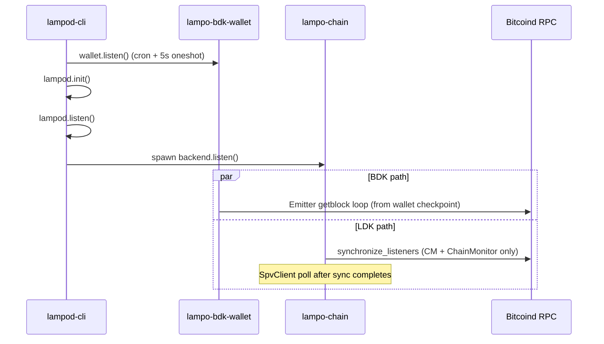

# Unified Chain Sync: Align Lampo with ldk-node

| Field | Value |
|-------|--------|
| Status | Draft |
| Author | Vincenzo Palazzo (with Grok-assisted analysis) |
| Date | 2026-06-03 |
| Related issues | [#540](https://github.com/vincenzopalazzo/lampo.rs/issues/540) (fast sync), [#444](https://github.com/vincenzopalazzo/lampo.rs/issues/444) (`reindex` semantics) |

## Summary

Lampo currently runs **two independent, competing chain-sync pipelines** over the same Bitcoin Core RPC backend: LDK `synchronize_listeners` (channel manager + chain monitor) and a separate BDK `Emitter` full-block scan (on-chain wallet). Production on Ocean Signet (~307k blocks) shows multi-day catch-up, RPC saturation, and LDK listener sync that never logs completion while the BDK path dominates `getblock` traffic.

**ldk-node** (used by **ldk-server**) solves this by registering the on-chain BDK wallet as an LDK `Listen` target and driving **one** `synchronize_listeners` pass, then a unified poll loop. This document proposes converging Lampo toward that model while preserving Lampo’s modular crates and optional checkpoint/fast-sync for signet/dev.

## Problem statement

### Observed production behavior (Signet, Jun 2026)

- **Backend:** Ocean bitcoind via SSH tunnel (`127.0.0.1:38332`).
- **Startup:** `lampod-cli --restore-wallet --log-level debug`.
- **Persisted state:** wallet checkpoint ~**21,021**; channel manager best block ~**190,537**; chain tip ~**307k**.
- **LDK chain listeners:** log `Syncing chain listeners from block … (height 190537)` once; **no** `Chain listeners synced` / `Start Backend` after **11+ hours**.
- **BDK wallet:** continuous `getblock` (~2 per block), scan height 21k → 91k+ at ~107 blocks/min; ETA ~34h remaining; `wallet_height` in API stuck at 21,021.
- **Logs:** 0 ERROR/WARN; benign lock skip messages every 2 min.
- **Anomaly:** no `Applied block` INFO lines and `bdk-wallet.db` mtime frozen while RPC scan advances (needs investigation during implementation).

### User impact

- Node appears “up” (`blockheight` = tip) but **Lightning chain listeners may not be caught up** and **on-chain wallet is not ready** for balances/UTXOs.
- Duplicate block downloads waste RPC bandwidth and wall-clock time.
- Operators cannot distinguish “syncing” vs “ready” from `getinfo` alone.

## Goals

1. **Single coordinated chain sync** for all LDK `Listen` targets including the on-chain wallet (ldk-node parity for bitcoind backend).
2. **Serialize or prioritize** initial sync so LDK listener sync completes and is observable before/alongside wallet catch-up.
3. **Expose sync progress** in `getinfo` (and logs): listener sync done, wallet scan height, percent/ETA optional.
4. **Optional fast-sync / checkpoint jump** for signet and empty wallets (extends [#540](https://github.com/vincenzopalazzo/lampo.rs/issues/540)).
5. **Retry/backoff** on transient RPC failures during `synchronize_listeners` (ldk-node pattern).

## Non-goals (this design)

- Replacing Lampo with ldk-node or ldk-server.
- Esplora/Electrum chain sources in the first PR (can follow; ldk-node tx-based sync is a separate follow-up).
- Changing LDK persistence format for channel manager.
- Mainnet policy for fast-sync defaults (must remain opt-in / safe).

## Current architecture (Lampo)



### LDK path (`lampo-chain/src/lib.rs`)

- `listen()` spawns async task.
- `synchronize_listeners` for **channel manager** and **chain monitor** only (not BDK wallet).
- On success: log + `SpvClient::poll_best_tip()` loop.
- Starting block: `channel_manager.current_best_block()` (e.g. 190537).

### On-chain path (`lampo-bdk-wallet/src/lib.rs`)

- `sync()` uses `bdk_bitcoind_rpc::Emitter` from `wallet.latest_checkpoint()`.
- Per-block `apply_block_connected_to` + `persist`.
- Scheduled via `tokio-cron-scheduler` (every 2 min + 5s initial); holds `guard` for entire `sync()`.
- `reindex_from` only when `start_height == 0` or explicit `conf.reindex` forward jump ([#444](https://github.com/vincenzopalazzo/lampo.rs/issues/444)).

### Startup order (`lampod-cli/src/main.rs`)

1. `wallet.listen().await?` — runs job scheduler (blocks until scheduler stops).
2. `lampod.init()` — includes `channel_manager.listen()` (start CM, not chain backend).
3. `run_httpd`, then `lampod.listen()` — spawns `onchain_manager().listen()` → chain backend.

**Issue:** wallet scheduler can start BDK full scan **before or in parallel with** chain `synchronize_listeners`, both hammering the same RPC client.

## Reference architecture (ldk-node / ldk-server)

ldk-server is a gRPC wrapper; chain behavior is defined in **ldk-node** (`src/chain/bitcoind.rs`).

### Bitcoind initial sync

1. `node.start()` starts chain source, updates fee estimates (blocking once).
2. Background task `continuously_sync_wallets`:
   - Builds `chain_listeners` vec: **on-chain `Wallet`**, **channel manager**, **output sweeper**, **chain monitor** (worst monitor block).
   - Single `synchronize_listeners(...).await`.
   - On success: log `Finished synchronizing listeners in Nms`, update metrics timestamps, then enter poll loop.
   - On failure: retry with exponential backoff (transient vs persistent).

### On-chain wallet during listener sync

- `Wallet` implements `Listen::block_connected`:
  - `apply_block_events` + `persist` per block (no parallel Emitter loop during initial sync).
- `filtered_block_connected` is intentionally unsupported (debug_assert in dev); full blocks from disagreement point are sufficient per BDK guidance.

### Ongoing updates

- `poll_and_update_listeners` updates **all** listeners together on new tips.
- `WalletSyncStatus` prevents overlapping syncs; `sync_wallets()` API waits on completion.

### Alternative chain sources

- Esplora/Electrum: transaction-based `sync_onchain_wallet` + `sync_lightning_wallet` (faster for large histories). Lampo does not implement this today.

## Comparison

| Aspect | Lampo (today) | ldk-node (bitcoind) |
|--------|---------------|---------------------|
| Listener set | CM + ChainMonitor | Wallet + CM + Sweeper + ChainMonitor |
| Block delivery to BDK | BDK `Emitter` / `getblock` | `Listen::block_connected` |
| RPC passes on restart | 2 (overlapping ranges) | 1 initial + incremental poll |
| Initial sync completion | Wallet: no API flag; LDK: log line missing in prod | Log + metrics timestamps |
| RPC error handling | Emitter error logged; listener stall unclear | Retry/backoff on `synchronize_listeners` |
| Progress in API | `wallet_height` stale during scan | `current_best_block`, sync timestamps |
| Fast sync | `reindex` / height 0 only | New wallet → tip checkpoint; restored → per-listener best block in one sync |
| Startup coupling | Wallet cron independent of LDK sync | `start()` coordinates background sync |

## Proposed solution

### Phase A — Coordination & observability (low risk)

**A1. Chain sync gate**

- Introduce `ChainSyncCoordinator` (in `lampo-chain` or `lampo-common`):
  - States: `PendingInitialSync` → `ListenersSynced` → `Running`.
  - `lampo-chain` sets `ListenersSynced` after `synchronize_listeners` + log.
  - `lampo-bdk-wallet` **does not** start `Emitter` full scan until `ListenersSynced` **OR** config `wallet_sync_parallel=true` (default `false` on mainnet, `true` on signet optional).

**A2. Extend `getinfo`**

Add fields (names illustrative):

```rust
pub struct GetInfo {
    // existing...
    pub wallet_height: u64,
    pub wallet_scan_height: Option<u32>,  // live progress during scan
    pub chain_listeners_synced: bool,
    pub initial_sync_complete: bool,
    pub sync_in_progress: bool,
}
```

Populate from coordinator + wallet tip.

**A3. Logging**

- Ensure `Chain listeners synced` and `Start Backend` are always emitted at INFO.
- Log wallet progress every N blocks (e.g. 1000) to avoid debug-only visibility.
- Fix typo: `Unable to take the log` → `lock` in `lampo-bdk-wallet`.

**A4. Startup reorder (minimal)**

In `lampod-cli`:

```text
lampod.init(client)           // CM, handlers, etc.
spawn lampod.listen()         // chain backend + LDK event loop
await initial_listener_sync() // or block HTTP until listeners synced (config)
wallet.start_scheduled_sync() // cron only after gate open
run_httpd()
```

Avoid blocking entire daemon on `wallet.listen().await?` before `init` (current code is confusing and may delay init depending on scheduler behavior).

### Phase B — Unified listener sync (ldk-node alignment)

**B1. `Listen` for BDK wallet**

- Implement `lampo_common::ldk::chain::Listen` for `BDKWalletManager` (wrapper around persisted BDK wallet), mirroring ldk-node `Wallet::block_connected`:
  - `apply_block_events` / equivalent for BDK 2.x API in use.
  - `persist` after each block.
  - Register LDK-relevant tx outputs when needed (funding txs) — defer if no channels yet.

**B2. Register wallet in `synchronize_listeners`**

In `lampo-chain/src/lib.rs`, extend `chain_listeners`:

```rust
let wallet_best = wallet_manager.current_best_block(); // new trait method
chain_listeners.push((wallet_best.block_hash, wallet_manager.as_listen()));
// existing CM + chain_monitor entries
```

**B3. Deprecate parallel Emitter for initial catch-up**

- Keep `Emitter` only for:
  - `dev_sync` / explicit `full_scan=true`, or
  - recovery when `Listen` sync detects inconsistency.
- Default path: wallet advances only via listener sync + SpvClient-driven updates.

**B4. RPC client sharing**

- Single `Arc<BitcoindRpc>` behind `BlockSource` used by `lampo-chain` only during sync; wallet does not spawn separate emitter concurrently.
- Optional: mutex around `synchronize_listeners` + poll (ldk-node-style `WalletSyncStatus`).

### Phase C — Fast sync & config ([#540](https://github.com/vincenzopalazzo/lampo.rs/issues/540))

**C1. Config**

```toml
# lampo.example.conf
sync_mode = "unified"   # unified | legacy (emitter)
fast_sync = false       # allow checkpoint jump when safe
fast_sync_min_height = 0  # only if wallet empty / user opt-in
reindex = 300000        # documented: forward checkpoint, not backward rescan
```

**C2. Safe fast-sync rules**

| Network | `fast_sync` default | Condition |
|---------|---------------------|-----------|
| mainnet | `false` | Manual enable + no UTXOs or explicit CLI flag |
| signet/testnet | `false` | Opt-in via config for dev |

When enabled: insert wallet checkpoint at `tip - confirmations_margin` before `synchronize_listeners`, same as existing `reindex_from` logic but documented and wired to `fast_sync`.

**C3. `sync_wallets` JSON-RPC**

- Add `sync_wallets` command (like ldk-node): block until initial unified sync completes; useful for scripts/CI.

## Key decisions

| Decision | Rationale |
|----------|-----------|
| Adopt ldk-node **unified `synchronize_listeners`** as default | Eliminates duplicate `getblock` work and RPC starvation; battle-tested in ldk-node. |
| Keep Lampo crate split (`lampo-chain`, `lampo-bdk-wallet`) | Avoid big-bang merge; integrate via traits (`Listen`, `WalletManager::current_best_block`). |
| Gate BDK Emitter behind coordinator initially | Low-risk fix for production stall; full `Listen` impl can follow in Phase B. |
| Do not enable fast-sync on mainnet by default | Safety over signet convenience ([#540](https://github.com/vincenzopalazzo/lampo.rs/issues/540)). |
| Defer Esplora/Electrum to later design | Separate tx-based sync path; reduces scope. |
| Expose sync state in `getinfo` | Operators need visibility; matches ldk-server `GetNodeInfo` timestamps concept. |

## Alternatives considered

1. **Switch Lampo to embed ldk-node** — Rejected: large product/architecture change; loses current Lampo HTTP/LN customization.
2. **Keep dual sync, only add RPC rate limit** — Rejected: still O(chain) duplicate downloads; does not fix listener starvation.
3. **BDK Emitter only, drop `synchronize_listeners`** — Rejected: breaks LDK channel/monitor chain order guarantees.
4. **Esplora for signet first** — Attractive follow-up; does not help current Ocean bitcoind deployment.

## Risks & mitigations

| Risk | Mitigation |
|------|------------|
| BDK API mismatch implementing `Listen` | Port ldk-node `Wallet::block_connected` closely; add integration test on signet regtest |
| Long initial sync still slow on bitcoind | Fast-sync config + signet defaults; document Esplora follow-up |
| Regression for existing wallets mid-Emitter scan | `sync_mode=legacy` flag; detect in-progress emitter DB and resume |
| `wallet.listen().await?` blocking CLI | Refactor scheduler spawn to `tokio::spawn` in Phase A |

## Testing plan

1. **Unit:** coordinator state transitions; `getinfo` fields.
2. **Integration:** regtest/signet node with wallet at 21k, CM at 190k, tip 300k+ — assert `Chain listeners synced` within bounded time; assert single RPC stream (count `getblock` before/after).
3. **Regression:** open channel after sync; verify no “blocks must be connected in chain-order” panic.
4. **Compare:** run same scenario against ldk-server with bitcoind RPC — document time-to-`Finished synchronizing listeners`.

## PR Plan

| PR | Title | Scope | Depends on |
|----|-------|-------|------------|
| 1 | `feat(sync): add ChainSyncCoordinator and getinfo progress fields` | `lampo-common`, `lampo-chain`, `lampod` inventory JSON | — |
| 2 | `fix(wallet): gate BDK Emitter until LDK listeners synced` | `lampo-bdk-wallet`, `lampod-cli` startup order | PR 1 |
| 3 | `feat(wallet): implement Listen for BDK wallet` | `lampo-bdk-wallet`, trait on `WalletManager` | PR 1 |
| 4 | `feat(chain): include wallet in synchronize_listeners` | `lampo-chain`, remove parallel initial Emitter | PR 3 |
| 5 | `feat(config): fast_sync and sync_mode + document reindex` | `lampo.example.conf`, CLI flags, README | PR 4 |
| 6 | `feat(jsonrpc): add sync_wallets endpoint` | `lampod`, `lampo-httpd` | PR 4 |
| 7 | `test(signet): integration test unified sync` | `lampo-testing` or docker CI | PR 4 |

## Open questions

1. Should HTTP/API bind be delayed until `initial_sync_complete` (ldk-node-style), or only report status?
2. Investigate missing `Applied block` logs in release builds — logging level vs apply path bug?
3. Should signet deployments default `fast_sync=true` in example config?

## References

- ldk-node: `src/chain/bitcoind.rs` — `continuously_sync_wallets`, `synchronize_listeners`
- ldk-node: `src/wallet/mod.rs` — `impl Listen for Wallet`
- Lampo: `lampo-chain/src/lib.rs` — `listen()`, `synchronize_listeners`
- Lampo: `lampo-bdk-wallet/src/lib.rs` — `sync()`, `Emitter`
- Production tracking: [#540](https://github.com/vincenzopalazzo/lampo.rs/issues/540)