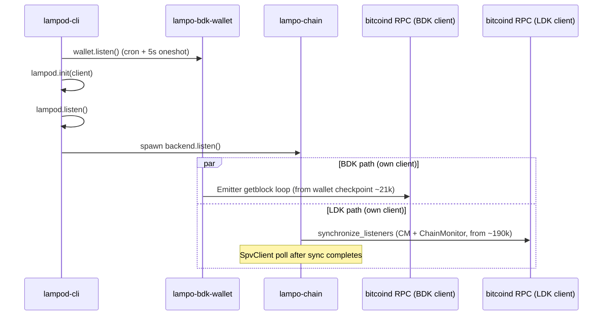

# Unified Chain Sync: Align Lampo with ldk-node *without losing backend/wallet pluggability*

| Field | Value |
|-------|--------|
| Status | Draft (rev. 2 — decoupled) |
| Author | Vincenzo Palazzo (with Grok-assisted analysis; rev. 2 decoupling pass) |
| Date | 2026-06-03 |
| Related issues | [#545](https://github.com/vincenzopalazzo/lampo.rs/issues/545), [#540](https://github.com/vincenzopalazzo/lampo.rs/issues/540) (fast sync), [#444](https://github.com/vincenzopalazzo/lampo.rs/issues/444) (`reindex` semantics) |

## Summary

Lampo currently runs **two independent, competing chain-sync pipelines** — over **two separate Bitcoin Core RPC clients**: LDK `synchronize_listeners` (channel manager + chain monitor, via `lightning-block-sync`'s `RpcClient`) and a separate BDK `Emitter` full-block scan (on-chain wallet, via `bdk_bitcoind_rpc::bitcoincore_rpc::Client`). Production on Ocean Signet (~307k blocks) shows multi-day catch-up, RPC saturation, and LDK listener sync that never logs completion while the BDK path dominates `getblock` traffic.

**ldk-node** (used by **ldk-server**) solves the efficiency problem by registering the on-chain BDK wallet as an LDK `Listen` target and driving **one** `synchronize_listeners` pass, then a unified poll loop.

This document proposes converging Lampo toward that **outcome** (one RPC stream, observable completion, no duplicate scan) **while explicitly preserving Lampo's modular design**, where the Lightning side and the Bitcoin side live behind traits and can be replaced independently. Concretely we **diverge from ldk-node in one place**: we do **not** implement LDK's `Listen` on the wallet. Instead the unavoidable LDK↔wallet coupling is **confined to the bitcoind backend crate (`lampo-chain`)** via a thin adapter, and unified sync is expressed as a **backend-agnostic** responsibility coordinated through `lampo-common`. This keeps the chain `Backend` swappable (Esplora/Electrum next) and the on-chain wallet swappable, with neither side leaking into the other.

## Design principle: backend-confined coupling (the three seams)

Lampo's replaceability rests on three trait seams. The whole point of this design is to keep them intact.

| Seam | Trait / type | Today's impl | What it abstracts |
|------|--------------|--------------|-------------------|
| Chain source | `Backend` (`lampo-common/src/backend.rs`) | `LampoChainSync` (`lampo-chain`) | How blocks/txs are fetched and how consumers are driven to tip |
| On-chain wallet | `WalletManager` (`lampo-common/src/wallet.rs`) | `BDKWalletManager` (`lampo-bdk-wallet`) | Keys, addresses, UTXOs, on-chain tx construction |
| Composition | `LampoChainManager` (`lampod/src/chain/blockchain.rs`) | holds `Arc<dyn Backend>` + `Arc<dyn WalletManager>` | Glues LN ↔ BTC; implements LDK `FeeEstimator`/`Broadcaster`/`UtxoLookup` |

**Invariant (hard):**

> The on-chain wallet crate must not depend on LDK chain-sync types. Any coupling that LDK's `Listen`/`synchronize_listeners` requires lives **inside the concrete `Backend` implementation** (e.g. `lampo-chain` for bitcoind), never in the wallet and never as a cross-crate contract.

**Corollary (backend swap is the priority axis):**

> Unified sync is a property of the `Backend`, coordinated by a backend-agnostic `ChainSyncCoordinator`. The bitcoind backend implements it with `synchronize_listeners` + a local `Listen` adapter. A future Esplora/Electrum backend implements the *same* contract with transaction-based sync (`Confirm`). The wallet and the LN consumers are unaware of which backend is in use.

This is the central revision relative to the original draft (and to ldk-node): the wallet exposes only **lampo-native** block/tx application; the bitcoind-specific `Listen` adapter is an implementation detail of `lampo-chain`.

## Problem statement

### Observed production behavior (Signet, Jun 2026)

- **Backend:** Ocean bitcoind via SSH tunnel (`127.0.0.1:38332`).
- **Startup:** `lampod-cli --restore-wallet --log-level debug`.
- **Persisted state:** wallet checkpoint ~**21,021**; channel manager best block ~**190,537**; chain tip ~**307k**.
- **LDK chain listeners:** log `Syncing chain listeners from block … (height 190537)` once; **no** `Chain listeners synced` / `Start Backend` after **11+ hours**.
- **BDK wallet:** continuous `getblock` (~2 per block), scan height 21k → 91k+ at ~107 blocks/min; ETA ~34h remaining; `wallet_height` in API stuck at 21,021.
- **Logs:** 0 ERROR/WARN; benign lock skip messages every 2 min.
- **Anomaly:** no `Applied block` INFO lines and `bdk-wallet.db` mtime frozen while RPC scan advances (needs investigation during implementation).

### Root cause

Two pipelines, two RPC clients, no coordination:

- `lampo-chain` (`LampoChainSync`) holds its own `lightning_block_sync::rpc::RpcClient` and runs `synchronize_listeners` (CM + ChainMonitor only) then `SpvClient::poll_best_tip()`.
- `lampo-bdk-wallet` (`BDKWalletManager`) holds a **separate** `bdk_bitcoind_rpc::bitcoincore_rpc::Client` and runs an `Emitter` full-block scan on a `tokio-cron-scheduler` (every 2 min + 5s one-shot), independent of the LDK path.

They contend for the same bitcoind, redundantly download the 190k→tip overlap, and starve each other. Neither knows the other's progress.

### User impact

- Node appears "up" (`blockheight` = tip) but **Lightning chain listeners may not be caught up** and **on-chain wallet is not ready** for balances/UTXOs.
- Duplicate block downloads waste RPC bandwidth and wall-clock time.
- Operators cannot distinguish "syncing" vs "ready" from `getinfo` alone.

## Goals

1. **Single coordinated chain sync** that drives all chain consumers (LN channel manager, chain monitor, on-chain wallet) to tip over **one** RPC client.
2. **Serialize / make observable** initial sync so listener sync completes (and is logged) before/alongside wallet catch-up.
3. **Expose sync progress** in `getinfo` and logs.
4. **Preserve the three trait seams** — wallet stays LDK-free; `Backend` stays swappable; coupling confined to the concrete backend crate. *(New, load-bearing goal.)*
5. **Be ready for tx-based backends** (Esplora/Electrum) without touching the wallet. *(New.)*
6. **Optional fast-sync / checkpoint jump** for signet and empty wallets (extends [#540](https://github.com/vincenzopalazzo/lampo.rs/issues/540)).
7. **Retry/backoff** on transient RPC failures during sync (ldk-node pattern).

## Non-goals (this design)

- Replacing Lampo with ldk-node or ldk-server.
- **Implementing LDK `Listen`/`Confirm` directly on the wallet** (explicitly rejected — see Alternatives).
- Building the Esplora/Electrum backend now (only making the seam ready).
- Changing LDK persistence format for channel manager.
- Mainnet policy for fast-sync defaults (must remain opt-in / safe).

## Current architecture (Lampo)



### LDK path (`lampo-chain/src/lib.rs`)

- `LampoChainSync` owns an `Arc<RpcClient>` and implements both `BlockSource` and the lampo `Backend` trait.
- `set_channel_manager` / `set_chain_monitor` inject the LDK objects via `OnceLock` (the wallet is **not** injected today).
- `Backend::listen()` runs `synchronize_listeners` for **channel manager + chain monitor** from `channel_manager.current_best_block()` (e.g. 190537), logs, then runs an `SpvClient::poll_best_tip()` loop.

### On-chain path (`lampo-bdk-wallet/src/lib.rs`)

- `sync()` uses `bdk_bitcoind_rpc::Emitter` from `wallet.latest_checkpoint()` over a **separate** `bitcoincore_rpc::Client`.
- Per-block `apply_block_connected_to` + `persist`.
- Scheduled via `tokio-cron-scheduler` (every 2 min + 5s one-shot); holds a `guard` mutex for the entire `sync()`.
- `reindex_from` only when `start_height == 0` or explicit `conf.reindex` forward jump ([#444](https://github.com/vincenzopalazzo/lampo.rs/issues/444)).

### Startup order (`lampod-cli/src/main.rs`)

1. `wallet.listen().await?` — starts the job scheduler.
2. `lampod.init(client)` — wires onchaind/channeld/etc., injects handler + CM + chain monitor into the backend.
3. `run_httpd`, then `lampod.listen()` — spawns `onchain_manager().listen()` → `Backend::listen()`.

**Issue:** wallet scheduler can start the BDK full scan **before or in parallel with** the LDK `synchronize_listeners`, both hammering bitcoind over distinct clients.

## Reference architecture (ldk-node / ldk-server)

ldk-server is a gRPC wrapper; chain behavior is defined in **ldk-node** (`src/chain/bitcoind.rs`).

### Bitcoind initial sync

1. `node.start()` starts chain source, updates fee estimates.
2. Background `continuously_sync_wallets`:
   - Builds `chain_listeners` vec: **on-chain `Wallet`**, **channel manager**, **output sweeper**, **chain monitor** (worst monitor block).
   - Single `synchronize_listeners(...).await`; on success logs `Finished synchronizing listeners in Nms`, updates metric timestamps, enters poll loop; on failure retries with backoff.

### On-chain wallet during listener sync

- ldk-node's `Wallet` implements `Listen::block_connected` (apply + persist per block); `filtered_block_connected` is intentionally unsupported.

### Alternative chain sources

- Esplora/Electrum use **transaction-based** `sync_onchain_wallet` + `sync_lightning_wallet` (LDK `Confirm`), *not* block-by-block `Listen`. This is the key reason Lampo must not hard-code the wallet into `synchronize_listeners`.

### Where Lampo deliberately diverges

ldk-node puts `Listen` **on the wallet**. Lampo will instead put the `Listen` adapter **in the bitcoind backend crate** and have the wallet expose only lampo-native apply methods. Same runtime behavior (wallet participates in the single `synchronize_listeners` pass), but the wallet stays LDK-free and the backend stays swappable.

## Comparison

| Aspect | Lampo (today) | ldk-node (bitcoind) | Lampo (this design) |
|--------|---------------|---------------------|---------------------|
| Listener set | CM + ChainMonitor | Wallet + CM + Sweeper + ChainMonitor | CM + ChainMonitor + **wallet adapter** (bitcoind backend only) |
| RPC clients | 2 (separate) | 1 | 1 |
| Block delivery to wallet | BDK `Emitter` | LDK `Listen` on wallet | lampo-native `WalletManager::apply_block`, driven by backend |
| Wallet ↔ LDK coupling | none | wallet depends on LDK | **none** (adapter lives in `lampo-chain`) |
| Backend swap (Esplora) | independent but duplicative | separate tx-path | same `Backend`/coordinator contract, wallet unchanged |
| Initial sync completion | log line missing in prod | log + metric timestamps | log + `getinfo` fields + coordinator state |
| RPC error handling | logged; stall unclear | retry/backoff | retry/backoff in backend |
| Progress in API | `wallet_height` stale | `current_best_block` + timestamps | coordinator state + wallet scan height |

## Proposed solution

Two destinations, shipped incrementally: **Phase A** stops the bleeding while preserving the design exactly (no new coupling). **Phase B** delivers the single-pass efficiency via the backend-confined adapter. **Phase C** adds config/RPC. **Phase D** (future) proves the seam with a tx-based backend.

### Phase A — Coordination & observability (low risk, zero new coupling)

**A1. `ChainSyncCoordinator` (backend-agnostic, in `lampo-common`)**

```rust
// lampo-common: no LDK, no BDK — pure state.
pub enum SyncState { PendingInitialSync, ListenersSynced, Running }

pub struct ChainSyncCoordinator { /* atomics / watch channel */ }

impl ChainSyncCoordinator {
    pub fn state(&self) -> SyncState;
    pub fn mark_listeners_synced(&self);
    pub fn mark_running(&self);
    pub fn wallet_scan_height(&self) -> Option<u32>;
    pub fn set_wallet_scan_height(&self, h: u32);
    pub async fn wait_listeners_synced(&self); // for sync_wallets RPC / startup gate
}
```

- The concrete `Backend` sets `ListenersSynced` after its sync mechanism completes (for bitcoind: after `synchronize_listeners`).
- The wallet (or the backend driving it) reports `wallet_scan_height`.

**A2. Gate the BDK Emitter**

- `lampo-bdk-wallet` does **not** start the `Emitter` full scan until the coordinator reports `ListenersSynced`, **unless** `wallet_sync_parallel = true`. This alone removes the "two pipelines at once" contention without any structural change — pure Phase-A safety net, valid even before Phase B lands.

**A3. Extend `getinfo`** (`lampo-common/src/model/getinfo.rs`)

```rust
pub struct GetInfo {
    // existing: node_id, peers, channels, chain, alias, blockheight,
    //           lampo_dir, address, block_hash, wallet_height ...
    pub wallet_scan_height: Option<u32>,  // live progress during scan
    pub chain_listeners_synced: bool,
    pub initial_sync_complete: bool,
    pub sync_in_progress: bool,
}
```

Populated from the coordinator + wallet tip.

**A4. Logging**

- Always emit `Chain listeners synced` and `Start Backend` at INFO.
- Log wallet progress every N blocks (e.g. 1000) at INFO (not debug-only).
- Fix typo: `Unable to take the log` → `lock` in `lampo-bdk-wallet`.

**A5. Startup reorder (minimal)** in `lampod-cli`:

```text
lampod.init(client)            // CM, handlers, inject CM/monitor into backend
spawn lampod.listen()          // backend sync + LDK event loop
coordinator.wait_listeners_synced().await   // or report-only, see Open Q1
wallet.start_scheduled_sync()  // cron only after gate opens (Phase A behavior)
run_httpd()
```

Refactor `wallet.listen().await?` (currently blocks on the scheduler before `init`) into a `tokio::spawn`.

### Phase B — Unified single-pass sync via backend-confined adapter

This is where we diverge from ldk-node to keep the seams. **No code in `lampo-bdk-wallet` references LDK.**

**B1. lampo-native apply on `WalletManager`** (`lampo-common`, pure bitcoin types)

```rust
#[async_trait]
pub trait WalletManager: Send + Sync {
    // ...existing...

    /// Best block the wallet has applied (for the backend to compute the
    /// sync start point). Pure bitcoin types.
    async fn current_best_block(&self) -> error::Result<BlockId>; // { height, hash }

    /// Apply a connected block. Mirrors what `sync()` already does
    /// internally via `apply_block_connected_to` + `persist`.
    async fn apply_block(
        &self,
        block: &Block,
        height: u32,
        connected_to: BlockId,
    ) -> error::Result<()>;

    /// Handle a disconnected block (reorg). BDK handles this via checkpoints;
    /// expose it so the backend can drive reorg-safe catch-up.
    async fn disconnect_block(&self, height: u32) -> error::Result<()>;
}
```

`BDKWalletManager` implements these by lifting the body of today's `sync()` loop — it already calls `apply_block_connected_to` + `persist`. No new dependency.

> Forward-compat note (do not build now): a tx-based backend will want
> `apply_confirmed_txs(...)` / `apply_unconfirmed_txs(...)`. Add it only when
> Phase D lands. BDK already supports `apply_update` / `apply_unconfirmed_txs`,
> so the seam is cheap to extend. Keep today's surface minimal (CLAUDE.md:
> "write for today, not hypothetical futures").

**B2. `Listen` adapter inside `lampo-chain`** (the only place LDK meets the wallet)

```rust
// lampo-chain — NOT lampo-common, NOT lampo-bdk-wallet.
struct WalletChainListener {
    wallet: Arc<dyn WalletManager>,
    rt: tokio::runtime::Handle, // bridge sync Listen -> async WalletManager
}

impl lampo_common::ldk::chain::Listen for WalletChainListener {
    fn block_connected(&self, block: &Block, height: u32) {
        let connected_to = /* prev BlockId from header */;
        self.rt.block_on(self.wallet.apply_block(block, height, connected_to))
            .expect("wallet apply_block");
    }
    fn block_disconnected(&self, header: &Header, height: u32) {
        self.rt.block_on(self.wallet.disconnect_block(height))
            .expect("wallet disconnect_block");
    }
    // filtered_block_connected: unsupported (debug_assert), as in ldk-node.
}
```

**B3. Inject the wallet into `lampo-chain` and register the adapter**

`LampoChainSync` already injects CM + chain monitor via `OnceLock`. Add the wallet the same way (`set_wallet_manager(Arc<dyn WalletManager>)`), then build one listener set:

```rust
let manager_best = channel_manager.current_best_block();
let wallet_best   = self.wallet().current_best_block().await?; // ~21k
let wallet_listen = WalletChainListener::new(self.wallet(), handle);

let chain_listeners: Vec<(BlockLocator, &(dyn chain::Listen + Send + Sync))> = vec![
    (manager_best.clone(), &*channel_manager),
    (manager_best.clone(), &*chain_monitor),
    (wallet_best,          &wallet_listen),     // <-- wallet joins, via adapter
];
let (cache, tip) = init::synchronize_listeners(self, network, chain_listeners).await?;
coordinator.mark_listeners_synced();
// SpvClient poll loop now drives ALL three on new tips.
```

`synchronize_listeners` already handles listeners at different start heights and reorgs, so the wallet (21k) and CM (190k) converge to tip in one reorg-safe pass over one RPC client.

**B4. Retire the parallel Emitter in unified mode**

- In `sync_mode = "unified"` (default), `lampo-bdk-wallet` does **not** spawn the cron `Emitter`; ongoing updates arrive through the backend's `SpvClient` poll → adapter → `apply_block`.
- Keep the `Emitter` path under `sync_mode = "legacy"` for fallback and for resuming an in-progress emitter DB.

```mermaid
sequenceDiagram
    participant C as lampo-chain (Backend)
    participant RPC as bitcoind RPC (single client)
    participant CM as ChannelManager
    participant CMon as ChainMonitor
    participant AD as WalletChainListener (adapter, in lampo-chain)
    participant W as WalletManager (lampo-native)

    C->>RPC: synchronize_listeners (one pass)
    RPC-->>C: blocks 21k..tip
    C->>CM: block_connected (from 190k)
    C->>CMon: block_connected (from 190k)
    C->>AD: block_connected (from 21k)
    AD->>W: apply_block(block, height, connected_to)
    Note over C: mark_listeners_synced(); then SpvClient poll drives all three
```

### Phase C — Fast sync & config ([#540](https://github.com/vincenzopalazzo/lampo.rs/issues/540))

**C1. Config** (`lampo.example.conf`)

```toml
sync_mode = "unified"        # unified | legacy (emitter)
wallet_sync_parallel = false # Phase-A gate override (mainnet default false)
fast_sync = false            # allow checkpoint jump when safe
fast_sync_min_height = 0     # only if wallet empty / user opt-in
reindex = 300000             # documented: forward checkpoint, not backward rescan
```

> `sync_mode` is intentionally about the **sync strategy of the active backend**,
> not a backend selector. The backend itself stays selected by `conf.node`
> ("core" today; "esplora"/"electrum" later) — see Phase D.

**C2. Safe fast-sync rules**

| Network | `fast_sync` default | Condition |
|---------|---------------------|-----------|
| mainnet | `false` | Manual enable + no UTXOs or explicit CLI flag |
| signet/testnet | `false` | Opt-in via config for dev |

When enabled: insert wallet checkpoint at `tip - confirmations_margin` before sync (the existing `reindex_from` logic, documented and wired to `fast_sync`).

**C3. `sync_wallets` JSON-RPC** — blocks until `coordinator.wait_listeners_synced()`; useful for scripts/CI. Lives in `lampod`/`lampo-httpd`, talks only to the coordinator (backend-agnostic).

### Phase D — Tx-based backend (future; proves the seam)

Not built now. Sketch only, to validate that the seams hold:

- A new `EsploraBackend` implements the `Backend` trait and the coordinator contract.
- Internally it uses LDK `Confirm` + BDK tx-based sync. It drives the wallet via the (then-added) `WalletManager::apply_confirmed_txs` — **the same lampo-native trait**, not a new cross-crate LDK contract.
- `lampo-bdk-wallet` requires **no change** to the existing block path; the `Listen` adapter stays in `lampo-chain` and is never compiled into the Esplora backend.

If Phase D requires *zero* edits to `lampo-bdk-wallet`, the design met its goal.

## Key decisions

| Decision | Rationale |
|----------|-----------|
| Unified single-pass sync as the destination | Eliminates duplicate `getblock` work and RPC starvation; battle-tested in ldk-node. |
| **Wallet stays LDK-free; `Listen` adapter lives in `lampo-chain`** | Preserves the `WalletManager` seam; wallet remains swappable; LDK coupling confined to the bitcoind backend. |
| **Unified sync is a `Backend` responsibility + backend-agnostic coordinator** | Keeps the `Backend` seam swappable; Esplora/Electrum (tx-based) fit the same contract. |
| Keep crate split (`lampo-chain`, `lampo-bdk-wallet`) | Integrate via lampo-native traits, not LDK contracts. |
| Gate BDK Emitter behind coordinator first (Phase A) | Low-risk production fix; full single-pass can follow in Phase B. |
| Inject `Arc<dyn WalletManager>` into `lampo-chain` via `OnceLock` | Mirrors existing CM/chain-monitor injection; no new dependency direction (already depends on `lampo-common`). |
| Do not enable fast-sync on mainnet by default | Safety over signet convenience ([#540](https://github.com/vincenzopalazzo/lampo.rs/issues/540)). |
| Expose sync state in `getinfo` + `sync_wallets` RPC | Operators need visibility; matches ldk-server concept; coordinator is backend-agnostic. |

## Alternatives considered

1. **`impl Listen`/`Confirm` directly on the BDK wallet (literal ldk-node parity, original Phase B).**
   *Rejected.* Couples `lampo-bdk-wallet` to LDK chain-sync types, puncturing the `WalletManager` seam, and hard-codes the block-based path — obstructing the Esplora/Electrum backend swap, which is the priority axis. Also offers no wiring benefit: `lampo-chain` still needs a handle to the wallet either way.
2. **Switch Lampo to embed ldk-node.** Rejected: large product/architecture change; loses Lampo's HTTP/LN customization and the trait seams entirely.
3. **Keep dual sync, only add an RPC rate limit.** Rejected: still O(chain) duplicate downloads; does not fix listener starvation.
4. **BDK Emitter only, drop `synchronize_listeners`.** Rejected: breaks LDK channel/monitor chain-order guarantees.
5. **Hoist `synchronize_listeners` orchestration up into `lampod`** (instead of injecting the wallet into `lampo-chain`). Viable, but spreads bitcoind-specific LDK glue into the composition layer; keeping it inside the concrete backend keeps `lampod` backend-agnostic. Revisit if a second block-based backend appears.

## Risks & mitigations

| Risk | Mitigation |
|------|------------|
| sync `Listen` adapter must bridge to async `WalletManager` | Hold a `tokio::runtime::Handle` and `block_on` the apply; or make the apply path sync internally. Benchmark; document. |
| Reorg handling for the wallet via adapter | Implement `block_disconnected` → `WalletManager::disconnect_block`; port ldk-node `Wallet::block_disconnected`; integration test reorgs on regtest. |
| BDK API mismatch lifting `sync()` into `apply_block` | Body already exists in `sync()`; reuse verbatim; signet regtest test. |
| Long initial sync still slow on bitcoind | Fast-sync config + signet defaults; Esplora follow-up (Phase D). |
| Regression for wallets mid-Emitter scan | `sync_mode = legacy` flag; detect in-progress emitter DB and resume. |
| `wallet.listen().await?` blocking CLI | Refactor scheduler spawn to `tokio::spawn` in Phase A. |
| Coupling creep back into the wallet | Add a CI grep/`cargo-deny`-style check or a doc test asserting `lampo-bdk-wallet` has no `lightning*` dependency. |

## Testing plan

1. **Unit:** coordinator state transitions; `getinfo` fields; adapter `block_connected`/`block_disconnected` delegate to `WalletManager`.
2. **Trait/decoupling guard:** assert `lampo-bdk-wallet`'s dependency tree contains no `lightning*` crate (CI check) — the modularity invariant as a test.
3. **Integration:** regtest/signet node with wallet at 21k, CM at 190k, tip 300k+ — assert `Chain listeners synced` within bounded time; assert a single RPC stream (count `getblock` before/after; expect ~1× over the overlap, not 2×).
4. **Reorg:** invalidate/reconsider blocks on regtest; assert wallet + CM converge without "blocks must be connected in chain-order" panic.
5. **Compare:** same scenario vs ldk-server with bitcoind RPC — document time-to-`Finished synchronizing listeners`.

## PR Plan

| PR | Title | Scope | Depends on |
|----|-------|-------|------------|
| 1 | `feat(sync): add backend-agnostic ChainSyncCoordinator + getinfo progress` | `lampo-common`, `lampod` inventory JSON | — |
| 2 | `fix(wallet): gate BDK Emitter until listeners synced; startup reorder` | `lampo-bdk-wallet`, `lampod-cli` | PR 1 |
| 3 | `feat(wallet): add lampo-native apply_block/current_best_block to WalletManager` | `lampo-common`, `lampo-bdk-wallet` (no LDK) | PR 1 |
| 4 | `feat(chain): wallet Listen adapter + include wallet in synchronize_listeners` | `lampo-chain` only (adapter lives here) | PR 3 |
| 5 | `feat(chain): retire parallel Emitter in unified mode` | `lampo-bdk-wallet`, `lampo-chain` | PR 4 |
| 6 | `feat(config): fast_sync + sync_mode + document reindex` | `lampo.example.conf`, CLI, README | PR 4 |
| 7 | `feat(jsonrpc): add sync_wallets endpoint` | `lampod`, `lampo-httpd` | PR 4 |
| 8 | `test: decoupling guard + signet unified-sync integration` | `lampo-testing`, CI | PR 4 |

## Open questions

1. Should the HTTP/API bind be delayed until `initial_sync_complete` (ldk-node-style), or only report status via `getinfo`?
2. Investigate missing `Applied block` logs in release builds — logging level vs apply-path bug?
3. Should signet deployments default `fast_sync = true` in the example config?
4. Adapter bridging: is `block_on` inside `Listen::block_connected` acceptable, or should `WalletManager::apply_block` have a sync sibling to avoid the runtime bridge?
5. When Phase D lands, does `WalletManager` grow `apply_confirmed_txs`, or do we introduce a separate `TxWalletSync` sub-trait to keep block-based wallets minimal?

## References

- ldk-node: `src/chain/bitcoind.rs` — `continuously_sync_wallets`, `synchronize_listeners`
- ldk-node: `src/wallet/mod.rs` — `impl Listen for Wallet` (the pattern Lampo deliberately re-homes into the backend)
- Lampo: `lampo-common/src/backend.rs`, `lampo-common/src/wallet.rs` — the two replaceable seams
- Lampo: `lampo-chain/src/lib.rs` — `LampoChainSync::listen()`, `synchronize_listeners`
- Lampo: `lampo-bdk-wallet/src/lib.rs` — `sync()`, `Emitter`
- Lampo: `lampod/src/chain/blockchain.rs` — `LampoChainManager` composition seam
- Production tracking: [#540](https://github.com/vincenzopalazzo/lampo.rs/issues/540)
